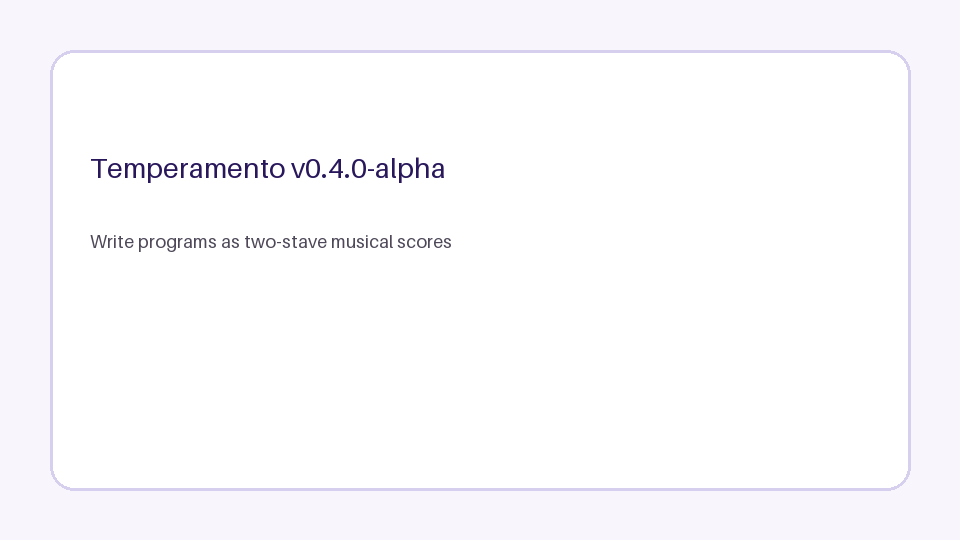

# Temperamento

Temperamento is a programming language in which executable programs may be written as text or as two-stave musical scores. Within a deliberately restricted MusicXML subset, exact major/minor triads on the **Base** staff form ordered computational pairs; duration-framed notes on the **Voice** staff encode root-relative base-12 operands. Other supported Base material remains in the score but is ignored and reported rather than declared invalid.

**Current release:** `v0.5.0`.



## Representations and directions

The implemented semantic chain is:

```text
TOScript+ ↔ TOScript Core ↔ MusicXML / MXL
```

- **TOScript+** (`.tom`, `.tos+`, `.tosplus`) is the ergonomic authoring form. The current release supports comments, non-negative constants, named labels, `jump`, `jump-if`, `output`, and quoted-string `print` sugar.
- **TOScript Core** (`.tos`) is the canonical executable representation.
- **MusicXML/MXL** is the portable score representation. Converting text or another score to MusicXML produces a canonical realisation, not a reconstruction of the original engraving.

The arrows denote canonical semantic conversion, not lexical or visual identity. TOScript+ conveniences lower to Core; Core can be lifted to a canonical TOScript+ form. MusicXML compiles to Core; Core can be notated as a deterministic two-stave MusicXML score. Compiling that generated score must recover byte-identical canonical TOScript.

MuseScore Studio or another notation system supplies engraved sheets and playback:

```text
MusicXML → MSCZ / PDF / SVG / MIDI / audio
```

Third-party audio-to-score transcription may be used as an exploratory input route, but it is not part of Temperamento's deterministic semantics and is not treated as a verified inverse.

## Quick start

```bash
python -m pip install -e .

# Score → canonical code
temperamento compile examples/arithmetic/add/add.musicxml

# TOScript+ → canonical code → execution
temperamento compile examples/directions/toscript-plus-to-score/toscript-plus-to-score.tom
temperamento run examples/directions/toscript-plus-to-score/toscript-plus-to-score.tom --output text

# Text → canonical score
temperamento score program.tom --output program.musicxml --title "Program"

# Any supported source → canonical TOScript+
temperamento decompile program.musicxml --output program.tom
```

With MuseScore Studio installed:

```bash
temperamento render program.musicxml --out-dir build --formats mscz,pdf,mp3
```

## Bidirectional examples

[`examples/directions/`](examples/directions/) contains three complete packages distinguished by their primary source:

| Example | Primary source | Verified path |
|---|---|---|
| [Score to Code](examples/directions/score-to-code/) | MusicXML | MusicXML → Core → canonical score → Core |
| [TOScript to Score](examples/directions/toscript-to-score/) | TOScript Core | Core → MusicXML → Core |
| [TOScript+ to Score](examples/directions/toscript-plus-to-score/) | TOScript+ | TOScript+ → Core → MusicXML → Core |

Each package includes TOScript+, canonical TOScript, MusicXML/MXL, a byte-identical round-trip program, expected execution, MIDI, deterministic score audio, execution audio, maps, HTML inspection, a README, and a machine-readable manifest. The MuseScore workflow adds editable MSCZ, engraved PDF, and MP3 playback.

Regenerate all deterministic and external-tool artefacts with:

```bash
make example-assets
```

`make examples` does not require MuseScore. `make render-examples` renders every committed MusicXML example through MuseScore and verifies that each MSCZ round trip preserves canonical code and runtime behaviour.

## Computational projection

- The accepted score source is one `score-partwise` part with exactly two declared staves, at most one MusicXML voice per staff, and no tied-note semantics.
- Within that subset, staff 2 (**Base**) may contain pitched notes, chords, and rests beyond the computational triads.
- An onset is computational if and only if its simultaneous pitch classes form an exact major or minor triad.
- Inversion, register, note order, and octave doubling do not affect computational triad identity.
- All other supported Base onsets are ignored before pairing and remain visible in inspection diagnostics.
- Recognised triads form non-overlapping ordered pairs.
- A cell is `(clockwise fifths distance, initial mode, final mode)`.
- The instruction space has 48 cells: seventeen assigned and thirty-one reserved.
- Staff 1 (**Voice**) encodes duration-framed operands relative to the first triad root.
- Transposing both staves preserves the complete canonical program.

C–F–G, for example, may be understood as `Csus4` or `Fsus2/C`. Temperamento does not select either interpretation; the event remains musical but noncomputational in the current Core.

## Computational universality

The idealised TOScript Core is Turing-complete. The repository includes an executable translation from deterministic two-counter machines, representing their counters as stack pair `(c1, c2)`. `SWAP` permits either counter to be updated while preserving that invariant.

The claim assumes unbounded natural-number values, stack capacity, output capacity, program size, and execution. The reference interpreter remains bounded by physical resources and configurable step, stack, output, integer-magnitude, and trace budgets. See [Computational universality](docs/UNIVERSALITY.md).

Turing completeness is a formal property of the idealised core, not a claim about musical or artistic value.

## Showcase

| Work | Computational role | Output |
|---|---|---|
| [Hello, World! Prelude](examples/showcase/hello-world-prelude/) | Unicode output | `Hello, World!` |
| [Conditional Canon](examples/showcase/conditional-canon/) | comparison and branching | `1` |
| [Countdown Étude](examples/showcase/countdown-etude/) | loop and mutable stack state | `3, 2, 1` |
| [Hanoi Three-Disc Study](examples/showcase/hanoi-three-study/) | fixed seven-move solution | move list |
| [Twelve Transpositions](examples/showcase/twelve-transpositions/) | twelve score variants, one byte-identical program | `12` |

The Hanoi work remains a fixed three-disc executable study, not a committed general solver. Universality establishes expressibility; it does not substitute for producing and validating a general score.

## Documentation

- [Documentation index](docs/README.md)
- [Status and scope](docs/STATUS.md)
- [Language guide](docs/LANGUAGE.md)
- [Computational universality](docs/UNIVERSALITY.md)
- [Design decisions](docs/DESIGN_DECISIONS.md)
- [Quick start](docs/QUICKSTART.md)
- [MuseScore workflow](docs/MUSESCORE.md)
- [Inspection GUI](docs/GUI.md)
- [Showcase and examples](docs/SHOWCASE.md)
- [Python API](docs/API.md)
- [Architecture](docs/ARCHITECTURE.md)
- [Reproducibility](docs/REPRODUCIBILITY.md)
- [Release process](docs/RELEASE.md)

## Verification

```bash
python -m pip install -e ".[dev]"
make reproducibility
```

This regenerates deterministic examples and computational media, runs formatting, linting, strict typing, tests, packaging and clean-environment installation, source-level CLI checks, and the documentation site. MuseScore engraving and playback are verified separately in a checksum-pinned workflow because they depend on an external application, fonts, and sound profiles.

## Scope boundary

Temperamento does not claim to interpret arbitrary music, provide general harmonic analysis, recover a unique score from sound, preserve an author's original TOScript+ spelling or score layout through canonicalisation, or make Western notation culturally universal.

## Author and licence

Tomas Laurenzo. MIT licence. See [`CITATION.cff`](CITATION.cff).
